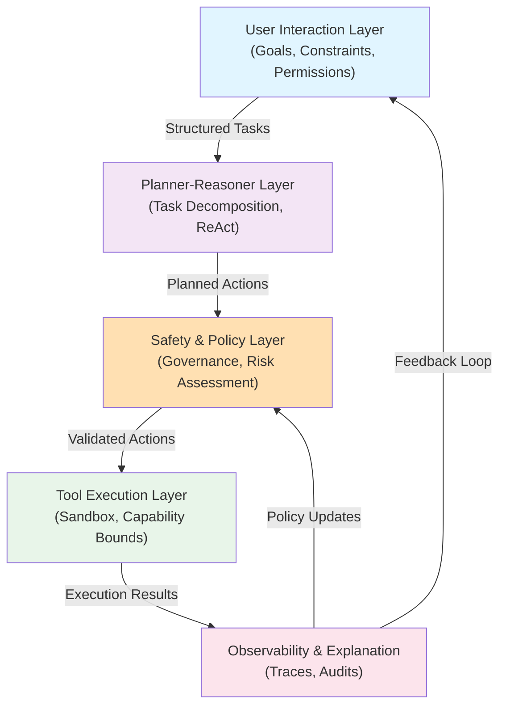
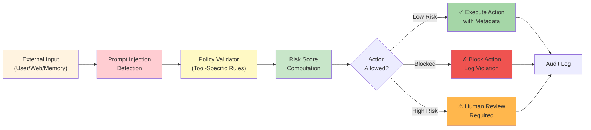
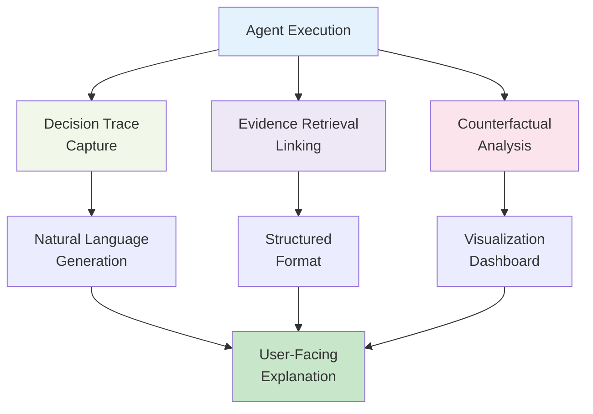
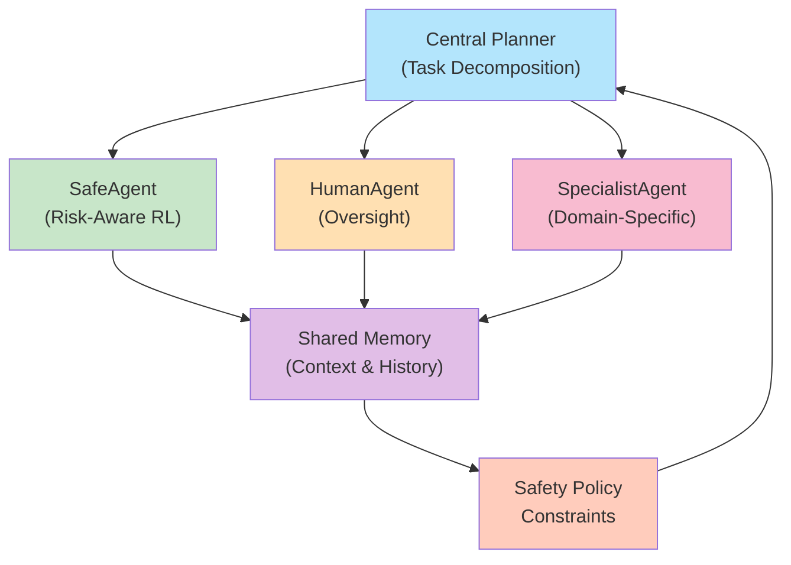
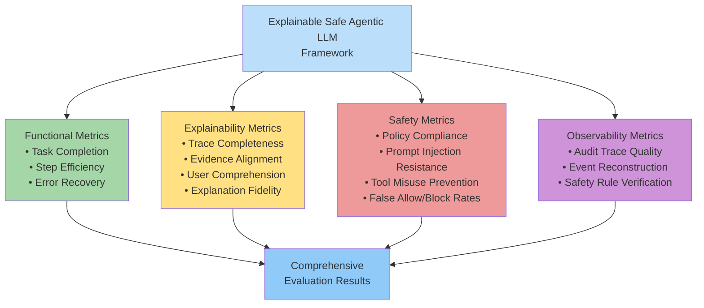
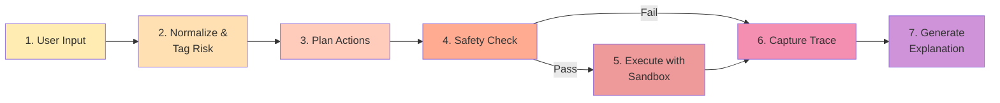
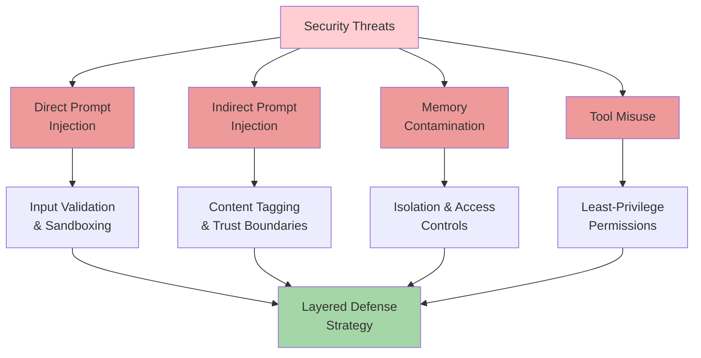

# Research Paper Images: Explainable Safe Agentic LLMs

## Figure 1: System Architecture Overview

## Figure 2: Safety & Policy Control Architecture

## Figure 3: Explainability Pipeline

## Figure 4: Multi-Agent Architecture

## Figure 5: Evaluation Methodology

## Figure 6: Component Interaction Flow

## Figure 7: Explainability Methods Matrix

| Method | Description | Used For |
|--------|-------------|----------|
| **Decision Trace** | Step-by-step execution log | Understanding agent reasoning |
| **Evidence Linking** | Maps actions to source data | Accountability & auditability |
| **Counterfactual Explanation** | Why actions were blocked | Understanding boundaries |
| **Attention Analysis** | Which inputs influenced output | Interpretability |
| **Feature Importance** | Which features drove decision | Model understanding |
| **Natural Language Summary** | Human-readable rationale | User communication |

## Figure 8: Safety Threat Model

---

## How to Use These Diagrams

These diagrams are rendered using Mermaid and can be:
1. Viewed directly in GitHub markdown files
2. Exported as SVG/PNG using Mermaid CLI
3. Embedded in research papers and presentations
4. Modified to reflect specific implementation details

For use in Word or LaTeX documents:
- Right-click and save as image
- Use Mermaid CLI: `mmdc -i DIAGRAM.md -o diagram.svg`
- Take screenshots for direct inclusion

---

## Diagram Descriptions for Paper

### Figure 1: System Architecture
Illustrates the five-layer approach to Explainable Safe Agentic LLMs: user interaction, planning, safety governance, tool execution, and observability.

### Figure 2: Safety Control
Shows how the safety and policy layer implements multiple control gates, including prompt injection detection, policy validation, and risk scoring.

### Figure 3: Explainability
Demonstrates how decision traces, evidence retrieval, and counterfactual analysis are combined to produce user-facing explanations in natural language and structured formats.

### Figure 4: Multi-Agent Design
Illustrates the coordination of SafeAgent (risk-aware), HumanAgent (oversight), and SpecialistAgent (domain-specific) under a central planner with shared memory and safety constraints.

### Figure 5: Evaluation Framework
Shows the four dimensions of evaluation: functional metrics, explainability metrics, safety metrics, and observability metrics.

### Figure 6: Component Flow
Sequential diagram showing how user input flows through normalization, planning, safety validation, execution, tracing, and explanation generation.

### Figure 7: Explainability Methods
Table summarizing the different explanation methods and their purposes in the framework.

### Figure 8: Threat Model
Maps security threats (direct/indirect prompt injection, memory contamination, tool misuse) to mitigation strategies, emphasizing layered defense.
